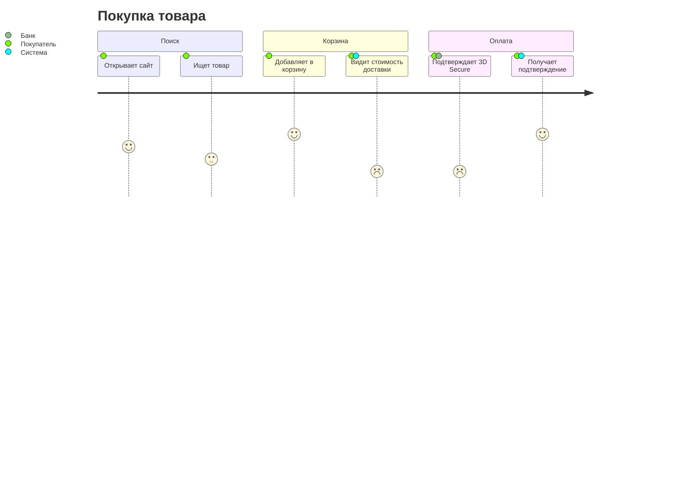

# Пример: User Journey Map

## Вход (от пользователя)

> Путь покупателя в интернет-магазине до оформления заказа.

## Фрагмент



## Выявленные проблемы (score ≤ 2)
- «Видит стоимость доставки» (2): неожиданно высокая цена → показывать раньше.
- «3D Secure» (2): friction неизбежен → улучшить UX ожидания.

## Рекомендации
- Приоритет 1: показывать доставку до корзины.
```
